<!-- ═══════════════════════════════════════════════════════════════════════ -->
<!--  KHANH020905 // PROFILE README  ·  palette: 030712 · 00F5FF · FF00FF · D7FF37  -->
<!-- ═══════════════════════════════════════════════════════════════════════ -->

<picture>
  <source media="(max-width: 640px)" srcset="assets/header-mobile.svg" />
  <source media="(prefers-color-scheme: light)" srcset="assets/header-light.svg" />
  
</picture>

<a href="https://quoc-khanh0209.vercel.app/">
<picture>
  <source media="(max-width: 640px)" srcset="assets/typing-mobile.svg" />
  
</picture>
</a>

<!-- ─────────────────────────────── WHOAMI ─────────────────────────────── -->

## 🧬 `> whoami`

<picture>
  <source media="(max-width: 640px)" srcset="assets/idcard-mobile.svg" />
  
</picture>

🎬 &nbsp;**Motion-first UI** &nbsp;·&nbsp; 🌐 &nbsp;**WebGL & 3D on the web** &nbsp;·&nbsp; 🎨 &nbsp;**Design → Code, pixel-exact** &nbsp;·&nbsp; ⚡ &nbsp;**Ship fast on Vercel**

<!-- ─────────────────────────────── TECH STACK ─────────────────────────────── -->

## 🧪 `> sudo install --tech-stack`

<picture>
  <source media="(max-width: 640px)" srcset="assets/stack-mobile.svg" />
  
</picture>

<!-- ─────────────────────────────── SKILL TREE ─────────────────────────────── -->

## 🕹️ `> skill_tree.exe`

<picture>
  <source media="(max-width: 640px)" srcset="assets/skills-mobile.svg" />
  
</picture>

<!-- ─────────────────────────────── FEATURED BUILDS ─────────────────────────────── -->

## 🚀 `> featured_builds --live`

<table border="0" cellspacing="0" cellpadding="6">
<tr>
<td align="center" width="33%" valign="top">
<a href="https://swp-391-project-kohl.vercel.app"></a>
<a href="https://github.com/khanh020905/SWP391-PROJECT">source ↗</a>
</td>
<td align="center" width="33%" valign="top">
<a href="https://wedding-dress-shop.vercel.app"></a>
<a href="https://github.com/khanh020905/wedding_dress_shop">source ↗</a>
</td>
<td align="center" width="33%" valign="top">
<a href="https://travel-lunara.vercel.app"></a>
<a href="https://github.com/khanh020905/Travel-Website-Lunara">source ↗</a>
</td>
</tr>
<tr>
<td align="center" width="33%" valign="top">
<a href="https://web-cgv.vercel.app"></a>
<a href="https://github.com/khanh020905/web-cgv">source ↗</a>
</td>
<td align="center" width="33%" valign="top">
<a href="https://ascenza-elevator.vercel.app"></a>
<a href="https://github.com/khanh020905/ascenza-elevator">source ↗</a>
</td>
<td align="center" width="33%" valign="top">
<a href="https://iot-project-murex.vercel.app"></a>
<a href="https://github.com/khanh020905/IOT-Project">source ↗</a>
</td>
</tr>
</table>

🎞 live motion previews — five real frames per site, re-captured every Monday by GitHub Actions · click a card to open the live site

＋ dozens more cinematic landing pages in <a href="https://github.com/khanh020905?tab=repositories&type=source">100+ public repos</a> — all deployed, all live.

<!-- ─────────────────────────────── STATS ─────────────────────────────── -->

## 📊 `> system.scan(performance)`

<picture>
  <source media="(max-width: 640px)" srcset="assets/stats-mobile.svg" />
  
</picture>

📡 synced daily by GitHub Actions · numbers straight from the GitHub GraphQL API

<!-- ─────────────────────────────── SNAKE ─────────────────────────────── -->

## 🐍 `> contribution_snake.run()`

<picture>
  <source media="(prefers-color-scheme: dark)" srcset="https://raw.githubusercontent.com/khanh020905/khanh020905/output/github-contribution-grid-snake-dark.svg" />
  <source media="(prefers-color-scheme: light)" srcset="https://raw.githubusercontent.com/khanh020905/khanh020905/output/github-contribution-grid-snake.svg" />
  
</picture>

🟢 eating one commit at a time · regenerated daily by GitHub Actions

<!-- ─────────────────────────────── CONNECT ─────────────────────────────── -->

## 📡 `> establish --connection`

&nbsp;

&nbsp;

  

  

<picture>
  <source media="(max-width: 640px)" srcset="assets/footer-mobile.svg" />
  <source media="(prefers-color-scheme: light)" srcset="assets/footer-light.svg" />
  
</picture>

